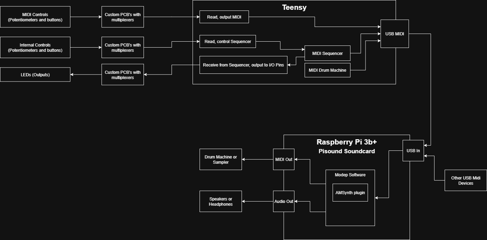

# Documentation
With the "Dapisse" I built a Midi controller (turning knobs, controlling software synths), which also acts as a midi sequencer. The sequencer is based on the intellijel metropolis, an awesome sequencer, shown by mylarmelodies here: https://www.youtube.com/watch?v=uV9-XA5MPwY

also included, we have a drumpad that can play midi notes to trigger drum sounds, but it can also create rhythms and different drum beats in changing intensity.

## Function diagram
A visual representation of how the Controller works

## Images

## What the controls do

### Midi Controller

### Sequencer

### Drumpad

## Code

## Sound examples
