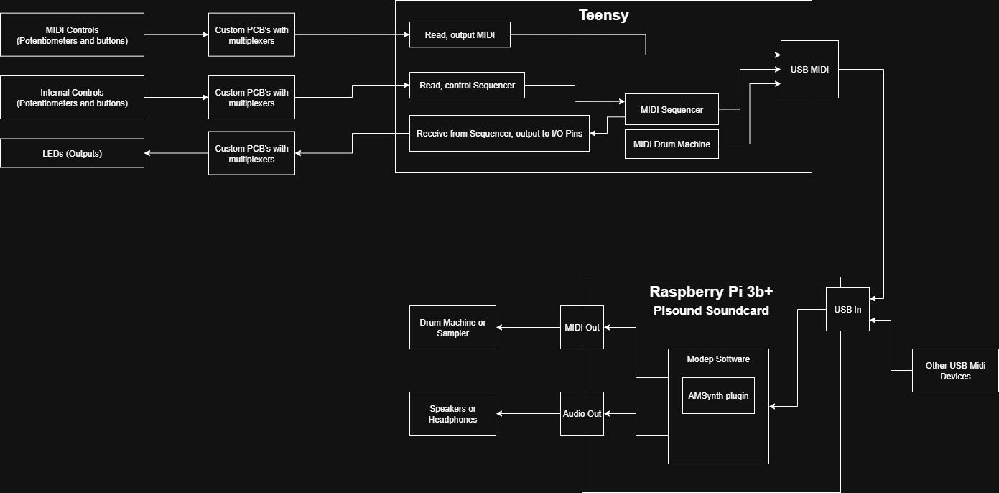
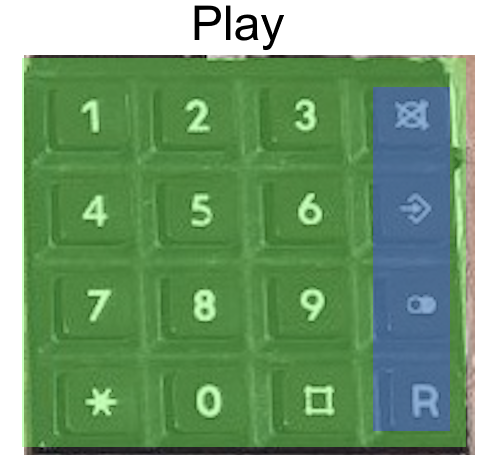
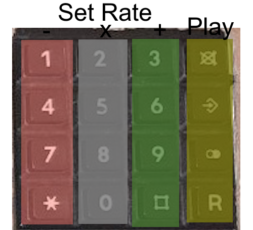
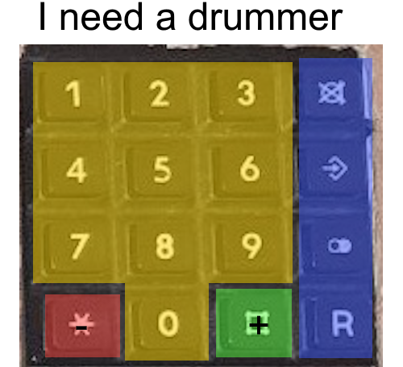

# Documentation
With the "Dapisse" I built a Midi controller (turning knobs, controlling software synths), which also acts as a midi sequencer. The sequencer is based on the intellijel metropolis, an awesome sequencer, shown by mylarmelodies here: https://www.youtube.com/watch?v=uV9-XA5MPwY

also included, we have a drumpad that can play midi notes to trigger drum sounds, but it can also create rhythms and different drum beats in changing intensity.

## Function diagram
A visual representation of how the Controller works


## Images

## What the controls do

### Midi Controller

### Sequencer

### Drumpad
Drumpad or Drum Machine will send Midi notes for example to trigger a drum sample. There are 4 "Instruments", just means 4 different Midi notes that will be triggered.
By default an Instrumen means a Kick, Snare, Hat and Cymbal. The Drum Machine also runs off the same Steps as the Sequencer, so that it is in sync. That's why I called it Instruments, The Synth is an instrument, the Kick is one etc... 
Default Midi Notes, defined in array drumInstrumentNotes[].
63, //Kick
67, //snare
71, //highhat
75  //cymbals

Each instrument is triggered from a different SubClock. Instruments 0-9 are Drum instruments, higher are "normal" instruments. Difference: Drum instruments only send NoteOn as trigger, no noteOff and not Gate Time.

#### Keypad Modes
Via a Pot you can select between 4 Keypad Modes
1: Play



In this mode, the Keypad is just a midi notePad or Keyboard. It will play notes from 60 to 75 on the drum Channel. The rightmost column (Blue) corresponds the midi notes of the 4 Instruments (kick, snare, hat, cymbal). You can simply play notes, also the drum notes. In the loop, the drumpad will not be read, hence no else drumpad function is executed.
Keys are initialized as "NoteButtonMatrix<4, 4> keypadMatrix". It will send the midi notes always, i didn't get to fix this yet. midi notes should only be sent in play mode. in other modes, the midi notes should be sent via the sequencer. i tried running keypadmatrix.enable() and .disable(), but that results in no control updating whatsoever.
Workaround would be to use a different midi channel for the keypadMatrix and the sequenced drum midi notes. maybe also use a filter within this code to filter out the keypad notes conditionally.

2: Perform
not implemented yet. idea is to do like a po-33 with ratchets, live effects on an existing drum beat.

3: setRate



SetRate lets you set the trigger Frequency of each instrument separately. Every Row is an instrument (Kick, Snare, Hat, Cymbal).
Every column features a different "effect" for each instrument individualy:
First Row (red): Decrease the frequency
Second Row (grey): Mute/unmute instrument
Third Row (green): Increase the frequency
Fourth Row (yellow): Play the instruments manually

There are 14 Trigger Frequencies (stored in const int numTriggerFrequencies) which you can navigate in (go up or down with first/third button):
  {0}, //1
  {12}, //1 off
  {0, 12}, //2
  {0, 8, 16}, //3
  {8, 16}, //3 Jump
  {0, 8, 20}, //3 Swing
  {0, 6, 12, 18}, //4
  {6, 12, 18}, //4 Jump
  {0, 8, 12, 20}, // 4 Swing
  {0, 8, 12, 16, 20}, //6 Jump
  {0, 4, 8, 12, 16, 20}, // 6
  {0, 3, 6, 9, 12, 15, 18, 21}, //8
  {0, 2, 4, 6, 8, 10, 12, 14, 16, 18, 20, 22}, // 12
  {0, 1, 2, 3, 4, 5, 6, 7, 8, 9, 10, 11, 12, 13, 14, 15, 16, 17, 18, 19, 20, 21, 22, 23} // 24
  
The instrument is triggered at a defined subTick in the clock cycle. every clock cycle has 24 subticks where something can be triggered.


4: I need a Drummer




Most Live-y Mode. Select between 10 different "Genres" or pre defined Drum Patterns (yellow). Each of the 10 Genres (buttons 0-9) have 5 different "intensities".
You can increase (green) or decrease (red) the intensity with the * and # Key. So a Punk beat will start basic, then with increasing intensity will get more snares, some cymbals and eventually a doubletime speed.

At the same time you can also play the instruments manually to add more notes into (blue).

Editing the Drum patterns:
To edit the drum patterns, see the files under /teensy/drumpatterns.txt. You have genre, 5 intensities per genre, 4 beats per intensity, 24 ticks per beat.
"x" means hit, "-" means pause.
To upload, you just paste them into the serial monitor. it doesn't work in the serial monitor of the arduino ide, but you can send the file via putty.
Uploading also works live while drum sequence is running.
```
BEGIN_DRUM_PATTERNS
LOAD
GENRE 0
INTENSITY 0

BEAT 0
x-----------------------
------------------------
------------------------
------------------------

BEAT 1
x-----------------------
------------------------
------------------------
------------------------

BEAT 2
x-----------------------
------------------------
------------------------
------------------------

BEAT 3
x-----------------------
------------------------
------------------------
------------------------


INTENSITY 1

BEAT 0
------------------------
------------------------
------------------------
------------------------
```
etc...
end file with
```
END_DRUM_PATTERNS
```
to paste whole file i did following in powershell:
```
Get-Content <your file name> | plink -serial <teensy com port> -sercfg 115200,8,n,1,N
Get-Content testfile.txt | plink -serial COM3 -sercfg 115200,8,n,1,N
```

## Code

## Sound examples
